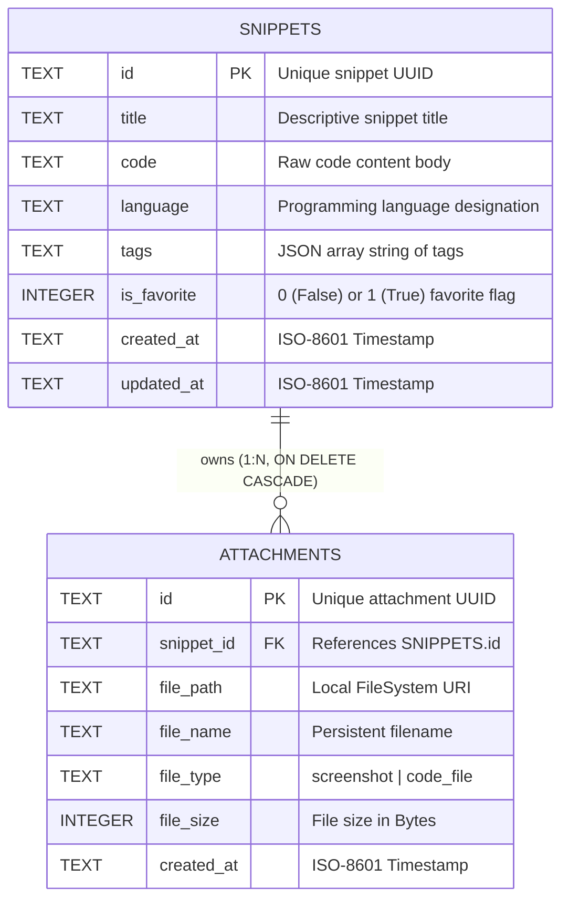
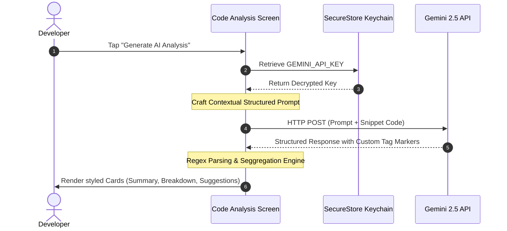

# DevSnippets AI 🚀
### *The Ultimate Offline-First Mobile Developer Workspace & Code Snippet Manager*

DevSnippets AI is an advanced, offline-first mobile application designed for software engineers and architects to capture, manage, share, and dynamically analyze code templates. Engineered with **Expo SDK 54**, **React Native**, **SQLite**, and **Google Gemini AI**, the application provides a premium developer-centric user experience complete with robust local file management, tactical haptic feedbacks, and a stunning three-way design theme system.

---

## 🏛️ System Architecture & Key Pillars

### 1. Database Structure (SQLite Relational Model)

DevSnippets AI relies on a fast, lightweight, and structured relational storage model utilizing `expo-sqlite`. By setting up a robust relationship structure and enabling foreign keys (`PRAGMA foreign_keys = ON;`), the application ensures high relational integrity.



#### Schema Specifications:
* **`snippets` Table**: Stores the core snippet object metadata. The `tags` array is serialized into a JSON string during database writes and deserialized upon retrieval to maintain clean array support in TypeScript.
* **`attachments` Table**: Captures linked local file resources (such as screenshots from compiler runs or reference images). It establishes a rigid relationship to its parent snippet with cascade deletion enabled (`ON DELETE CASCADE`), ensuring no orphaned files persist in the database.

---

### 2. Offline Storage Approach

To enable a resilient and fully operational offline workspace, DevSnippets AI combines multiple local storage methodologies tailored to their specific data integrity requirements:

| Storage Type | Technology | Purpose / Use Case | Details |
| :--- | :--- | :--- | :--- |
| **Structured Relational** | `expo-sqlite` | Local snippet indexing, full-text filters, favorited lists, and attachment records. | Allows sub-millisecond querying, sorting, and tag-filtering across thousands of code templates offline. |
| **Persistent Raw Files** | `expo-file-system` | Screenshots, exported source code files (`.js`, `.json`, `.txt`), and boilerplates. | Saves physical files in the application's secure container sandbox. |
| **Encrypted Keychain** | `expo-secure-store` | Google Gemini API Key storage. | Relies on hardware-backed encryption (iOS Keychain & Android Keystore) to keep user keys highly secure. |
| **Key-Value State Cache** | `@react-native-async-storage/async-storage` | Visual user preferences (e.g., Theme Selection). | Caches the active interface styling preference across app restarts. |

---

### 3. File Management Implementation

Physical file storage and management are handled by a dedicated native coordinator (`lib/fileHelper.ts`). Files are programmatically organized under the application's root sandboxed directory namespace: `${FileSystem.documentDirectory}DevSnippets/`.

```
📂 DevSnippets/  (Root Directory)
 ├── 📂 screenshots/  <-- Persistent screenshots attached to snippets
 ├── 📂 exports/      <-- Dynamic snippet code file outputs (.js, .json, .txt)
 ├── 📂 templates/    <-- Auto-seeded developer boilerplates
 └── 📂 downloads/    <-- Relocated / imported developer resources
```

#### Core File Operations:
* **Initialization Layer (`initFileSystem`)**: A defensive directory-creation mechanism that runs asynchronously on application startup, initializing folder structures recursively if they do not yet exist on the device.
* **Template Seeding Engine (`seedDefaultTemplates`)**: Seeding standard boilerplate files (`react-local-storage-hook.js`, `flask-hello-api.py`, `express-quickstart.js`) into `/templates/` on initial startup or during full database resets to populate the editor immediately with useful boilerplate.
* **File Exporter (`exportSnippetFile`)**: Dynamically writes snippet content to disk as `.js`, `.json` (packaged metadata), or structured `.txt` files in the `/exports/` directory.
* **Relocation Tool (`moveOrCopyFile`)**: Allows users to seamlessly move or copy local resources between folders (`screenshots/`, `exports/`, `downloads/`, and root) using physical file manipulation.
* **Directory Browser (`browseDirectory`)**: An interactive file explorer support system that scans local folders, reads file sizes, and returns structured data about each child node.

---

### 4. AI Integration Workflow

DevSnippets AI features an extensive **AI Code Analysis & Optimization Hub** utilizing the **Google Gemini API** (`gemini-2.5-flash`). The integration is designed to run securely and output highly structured markdown sections.



#### Structuring & Parsing the Output:
To prevent unstructured, free-form outputs from breaking the user interface layout, the system enforces a strict container constraint through contextual prompts. The AI is commanded to return the analysis partitioned by custom markers: `[EXPLANATION_START]/[EXPLANATION_END]`, `[SUMMARY_START]/[SUMMARY_END]`, and `[SUGGESTIONS_START]/[SUGGESTIONS_END]`.

The application's parser extracts these segments on response arrival:
```typescript
const expMatch = rawText.match(/\[EXPLANATION_START\]([\s\S]*?)\[EXPLANATION_END\]/);
const sumMatch = rawText.match(/\[SUMMARY_START\]([\s\S]*?)\[SUMMARY_END\]/);
const sugMatch = rawText.match(/\[SUGGESTIONS_START\]([\s\S]*?)\[SUGGESTIONS_END\]/);

const cleanExplanation = expMatch ? expMatch[1].trim() : rawText;
const cleanSummary = sumMatch ? sumMatch[1].trim() : "Code analyzed successfully.";
const cleanSuggestions = sugMatch ? sugMatch[1].trim() : "No critical optimization suggestions.";
```
These segmented sections are then rendered in isolated, visual cards with customized colors, icons, and typography.

---

## 🎁 Bonus & Premium Features Implemented

* **Dynamic Code Syntax Highlighter**: Built entirely in React Native, the syntax highlighter performs fast regex-based token coloring on-the-fly. It highlights keywords, comments, strings, imports, and digits, and provides real-time line numbering and a copy-to-clipboard button.
* **Interactive Local File Explorer**: Includes a native file browser interface where developers can explore local folders, preview code, view screenshot thumbnails, relocate files, delete resources permanently, or share them.
* **Three-Way Visual Theme System**: Users can toggle between three highly polished color palettes:
  1. **Light Mode**: Vibrant, clean slate theme.
  2. **Modern Dark**: Sleek dark slate theme.
  3. **AMOLED Black**: True pitch-black theme optimized for maximum power savings on OLED screens.
* **Tactile Haptic Feedback Engine**: Deep integration of `expo-haptics` triggers light physical ticks on navigation, medium ticks on favorite toggles, and heavy vibrations during deletions and settings resets to make interactions feel physically responsive.
* **Seeding & Danger-Zone Purge Settings**: Enables seeding of templates, viewing real-time storage statistics (total file space used, snippet count, screenshot counts), clearing keys, and resetting database schemas securely.

---

## 🛠️ Installation & Setup

1. **Clone & Install Dependencies**:
   ```bash
   npm install
   ```

2. **Start the Application**:
   ```bash
   npx expo start
   ```

3. **Configure the AI Key**:
   * Open the app, select the **Settings** tab.
   * Enter your Google Gemini API Key. (You can acquire a free key from the [Google AI Studio](https://aistudio.google.com/)).
   * Tap **Save Key** to securely save the token. You can now analyze all your snippets instantly!

---
*DevSnippets AI — Local first, secure, and powered by Gemini.*
